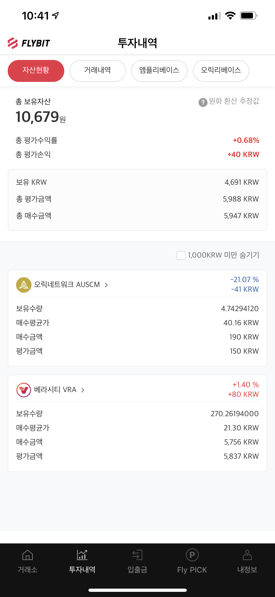
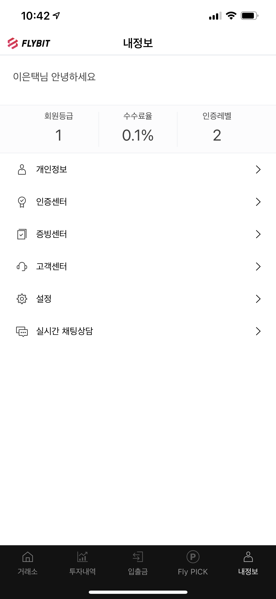
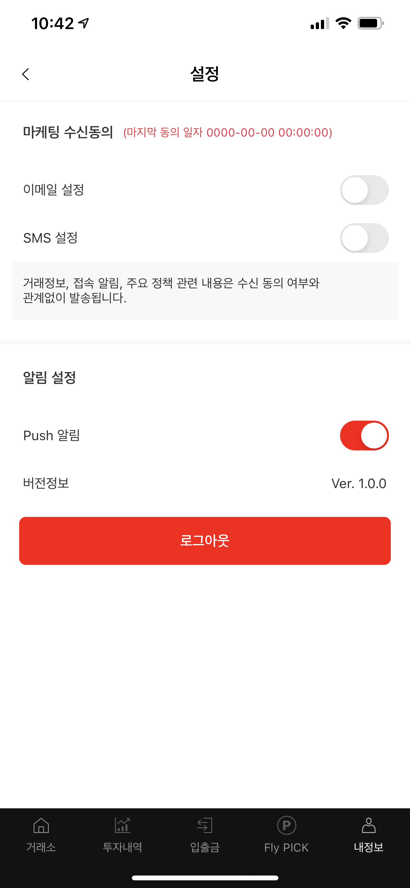
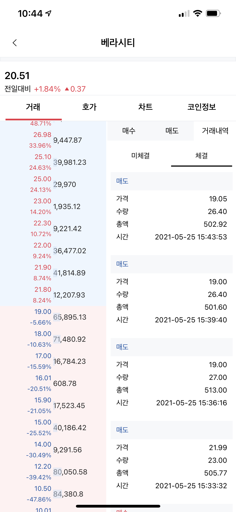

# 이은택

Github : https://github.com/CatMaster-Developer

Mail : letzzang@gmail.com

## 경력

[한국디지털거래소](https://flybit.com)
- 차장 - 2021/03 ~ 재직중

[빅솔론](https://bixolon.com/kr/)
- 과장 - 2016/02 ~ 2021.02

[GNSD]()
- 주임 - 2014/12 ~ 2016/02

[m3mobile](http://www.m3mobile.co.kr/)
- 연구원 - 2010/03 ~ 2012/08

## 회사 프로젝트

### Flybit

- 소속 : 한국 디지털 거래소
- 역할 : Flybit iOS 앱 신규 개발 및 유지 보수
- Skill : Swift, RxSwift, Unit test, git, Realm, firebase, WebSocket, non-storyboard, SPM, RxAlamofire, AutoLayout, RestApi
- 개발 기간 : 2021.03.21 ~ 2021.05.25
- 내용
  - 가상화폐 거래소 앱인 Flybit iOS 앱 신규개발 및 유지보수
- 앱 동작 영상 Link : https://youtu.be/8OvG8FRRNKI
- Link : https://apps.apple.com/us/app/flybit/id1570368673

  

### Common Library 개발 < Communicator / Making Data >

- 소속 : 빅솔론
- 역할 : 통신 모듈 / 데이터 생성 모듈 개발
- Skill : Objective-C, iOS, Unit test, git
- 내용
  - 다수의 SDK / APP에서 공통으로 사용하는 기능을 Row 레벨로 개발 
  - 프린터에서 사용하는 커맨드 생성 모듈 개발
  - 프린터와 통신에 필요한 기능 개발 < Bluetooth, Wi-fi, ethernet, BLE >

###  mPrint

- 소속 : 빅솔론
- 역할 : iOS App 개발
- Skill : Swift, Realm, CoreData(old version)  Snapkit, RxSwift, RxCocoa, Action Extension, non-storyboard, Unit test,  git, carthage
- 내용
  - Action Extension 을 제공하여 3rt Party App에서 프린터 인쇄 기능 지원
- AppStore Link (https://apps.apple.com/app/id1439539765)

  

###  mPrint Server

- 소속 : 빅솔론
- 역할 : iOS App 개발
- Skill : Swift, Realm, AutoLayout(Storyboard), Javascript, REST API, Unit test, git, cocoapods
- 내용
  - WebServer를 지원하는 WebApp 개발
  - Sample Web 개발
- AppStore Link (https://apps.apple.com/app/id1472321772)
- Web Sample Link (http://bixolon.com/common/mPrintService/Sample_PosPrinter.html)

  

###  Bixolon Utility

- 소속 : 빅솔론
- 역할 : iOS App 개발
- Skill : Swift, Realm, AutoLayout(Snapkit), Unit test, git, carthage
- 내용
  - 빅솔론 프린터 설정 기능을 지원
- AppStore Link (https://apps.apple.com/app/id1495617320)

  
  
<<<<<<< HEAD
  
=======

### UPOS SDK(POS 프린터 제어) Refactoring

- 소속 : 빅솔론
- 역할 : iOS SDK 리팩토링, Sample App 개발
- Skill : Objective-C, Swift, iOS, Unit test, git
- 내용 
  - 외부 Header 파일 제외한 내부 코드 재구현
  - MRC -> ARC
  - 누락된 API 구현 및 미지원 API Deprecate
  - 다중 프린터 동시 연결 기능 지원
  - Sample App 구현 ( Obj-C / Swift )
- DownLoad Link (https://www.bixolon.com/_lib/download_single.php?FILE_INFO=sdk|sdk_file|sdk_idx|30|sdk)

### Label SDK(Label 프린터 제어) Refactoring 

- 소속 : 빅솔론
- 역할 : iOS SDK 리팩토링, Sample App 개발
- Skill : Objective-C, Swift, iOS, Unit test, git
- 내용 
  - 외부 Header 파일 제외한 내부 코드 재구현
  - MRC -> ARC
  - 누락된 API 구현 및 미지원 API Deprecate
  - 다중 프린터 동시 연결 기능 지원
  - Sample App 구현 ( Obj-C / Swift )
- DownLoad Link (https://www.bixolon.com/_lib/download_single.php?FILE_INFO=sdk|sdk_file|sdk_idx|29|sdk)

###  ICPAY

- 소속 : 빅솔론
- 역할 : iOS App 개발
- Skill : Swift, Realm, Sqlite,  Snapkit, RxSwift, RxCocoa, non-storyboard, Unit test, carthage, App To App, Codable
- 내용
- 빅솔론 프린터의 카드리더기를 이용해 결제 진행
- AppStore Link (https://apps.apple.com/app/id1139655329)

###  Easy Setup Utility

- 소속 : 빅솔론
- 역할 : iOS App 개발
- Skill : Objective-C, Sqlite, AutoLayout(Storyboard), git
- 내용
  - 빅솔론 프린터 설정 기능을 지원
- AppStore Link (서비스 종료 -> Bixolon Utility 대체)

  

  

###  포드 AVN 개발 

- 소속 : GNSD
- 역할 : Bluetooth / Setting / DVD 모듈 개발
- Skill : Linux, QT
- 내용
  - Linux 기반 AVN(audio video navigation) 개발 중 Bluetooth / Setting / DVD 모듈 개발
    
  
    
    

###  UNI SDK(Scanner)

- 소속 : M3Mobile
- 역할 : WinCE Scanner 통합 SDK 개발
- Skill : C, C++, C#, MFC, 디자인패턴(abstract factory/singleton), svn
- 내용
  - 기존 모듈 별로 나뉘어 진 Scanner SDK를 하나의 SDK로 지원
  - C# SDK 제공(lib import)
  - MFC
  
###  UNI SDK(system)

- 소속 : M3Mobile
- 역할 : WinCE System 통합 SDK 개발
- Skill : C, C++, C#, MFC, 디자인패턴(abstract factory/singleton), svn
- 내용
  - M3Mobile PDA(단종모델 제외) 시스템 제어 용 SDK 개발

  

